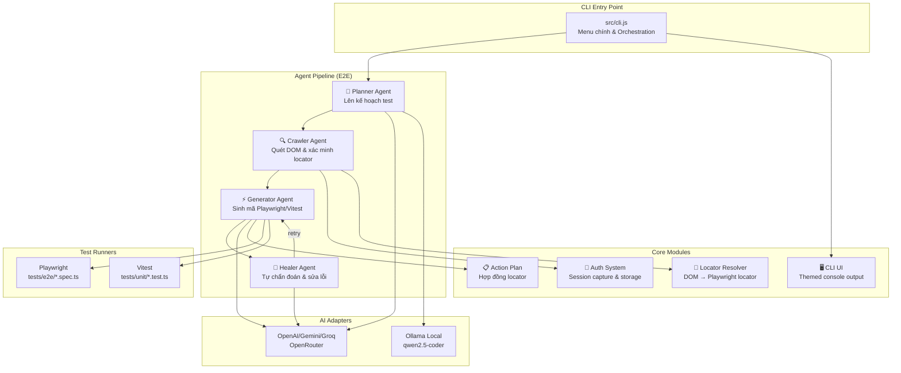
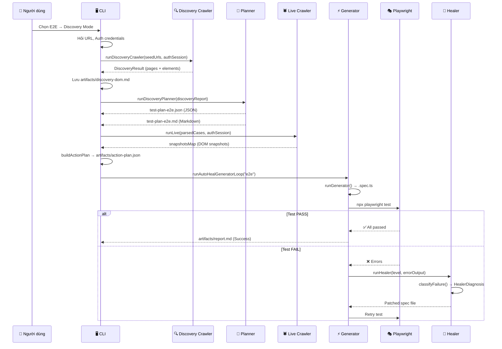
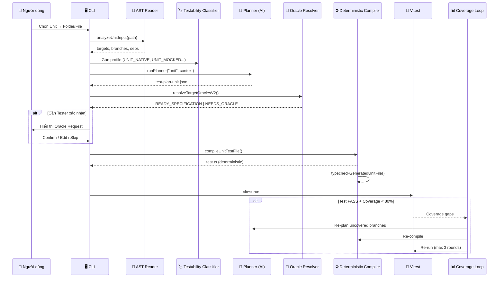

# 📋 TÀI LIỆU BÀN GIAO DỰ ÁN — AI AutoTest Toolkit (AIAUTOTEST)

> **Phiên bản**: 1.0.0 · **Ngày tạo**: 20/08/2026 · **Ngôn ngữ CLI**: Tiếng Việt  
> **Repository**: `c:\Users\dinhn\OneDrive\Documents\Github\AIAUTOTEST`

---

## 📖 Mục lục

1. [Tổng quan dự án](#1-tổng-quan-dự-án)
2. [Kiến trúc hệ thống](#2-kiến-trúc-hệ-thống)
3. [Cấu trúc thư mục](#3-cấu-trúc-thư-mục)
4. [Agent Pipeline chi tiết](#4-agent-pipeline-chi-tiết)
5. [Core Modules](#5-core-modules)
6. [CLI — Giao diện dòng lệnh](#6-cli--giao-diện-dòng-lệnh)
7. [Adapters — AI Provider](#7-adapters--ai-provider)
8. [Cấu hình & Biến môi trường](#8-cấu-hình--biến-môi-trường)
9. [Hệ thống Artifacts](#9-hệ-thống-artifacts)
10. [Hướng dẫn cài đặt & Chạy dự án](#10-hướng-dẫn-cài-đặt--chạy-dự-án)
11. [Quy ước & Best Practices đã thiết lập](#11-quy-ước--best-practices-đã-thiết-lập)
12. [Hạn chế & Lưu ý kỹ thuật](#12-hạn-chế--lưu-ý-kỹ-thuật)
13. [Ghi chú phát triển & Roadmap](#13-ghi-chú-phát-triển--roadmap)

---

## 1. Tổng quan dự án

### Mục đích

**AIAUTOTEST** là bộ công cụ CLI tương tác tự động hóa kiểm thử phần mềm đa tầng (E2E, Integration, Unit) sử dụng **AI Agent Pipeline**. Hệ thống kết hợp phân tích tĩnh AST (TypeScript Compiler API) với mô hình AI (Gemini, Groq, OpenRouter) để:

- **Lên kế hoạch** test case theo chuẩn QA (ISTQB/IEEE 829)
- **Tự động cào DOM** trang web và thu thập locator
- **Sinh mã test** Playwright (E2E) và Vitest (Unit/Integration)
- **Tự chữa lành** (Self-Healing) khi test fail

### Triết lý thiết kế

> **"Tất định thắng AI"** (Deterministic > AI)

- Executor (Playwright/Vitest) là **người kiểm chứng cuối cùng**.
- AI **không bao giờ** tự tuyên bố test pass nếu runner thất bại.
- Mọi thay đổi Expected Result phải có **bằng chứng AST** hoặc **xác nhận từ Tester**.

### Tech Stack

| Công nghệ | Vai trò |
|---|---|
| **Node.js ≥ 18** + **TypeScript 5.9** | Runtime & type checking |
| **Playwright** | E2E browser automation |
| **Vitest** | Unit & Integration test runner |
| **Inquirer.js** | CLI interactive prompts |
| **OpenAI SDK** (OpenAI-compatible) | AI model adapter |
| **tsx** | TypeScript execution without build |
| **Testcontainers** | Database sandbox (PostgreSQL, MySQL, SQLite) |

---

## 2. Kiến trúc hệ thống

### 2.1. Sơ đồ kiến trúc tổng thể



### 2.2. Luồng dữ liệu E2E (Discovery Mode)



### 2.3. Luồng dữ liệu Unit Test



---

## 3. Cấu trúc thư mục

```text
AIAUTOTEST/
├── src/                              # MÃ NGUỒN CHÍNH
│   ├── cli.js                        # ★ Entry point CLI (~1660 dòng, monolithic)
│   ├── api-test-cli.js               # CLI riêng cho API test (cũ)
│   ├── adapters/                     # AI Model Adapters
│   │   ├── index.ts                  # Interface: ModelAdapter, AgentResult
│   │   ├── openai.ts                 # ★ OpenAI-compatible (Gemini/Groq/OpenRouter)
│   │   └── ollama.ts                 # Ollama local adapter
│   ├── agents/                       # CÁC AI AGENT
│   │   ├── planner/                  # Agent 1: Lên kế hoạch
│   │   │   ├── run.ts                # Runner chính (runPlanner, runDiscoveryPlanner)
│   │   │   ├── schema.ts             # TypeScript interfaces cho Plan
│   │   │   ├── normalizer.ts         # Chuẩn hóa TC ID theo ISTQB
│   │   │   ├── validator.ts          # Validate JSON plan output
│   │   │   ├── markdown-renderer.ts  # Render plan → Markdown table
│   │   │   ├── unit-coverage-loop.ts # Vòng lặp bổ sung coverage
│   │   │   ├── prompt-e2e.md         # Prompt cho Script Mode E2E
│   │   │   ├── prompt-e2e-discovery.md # Prompt cho Discovery Mode E2E
│   │   │   ├── prompt-integration.md # Prompt cho Integration
│   │   │   ├── prompt-unit.md        # Prompt cho Unit
│   │   │   └── worst-case-guidelines.md # Hướng dẫn worst-case scenarios
│   │   ├── crawler/                  # Agent 2: Quét DOM
│   │   │   ├── discovery-crawler.ts  # BFS crawler đa trang
│   │   │   ├── live-runner.ts        # ★ Live Multi-State Crawler (~1400 dòng)
│   │   │   ├── locator-registry.ts   # Guided Learning locator cache
│   │   │   └── run.ts                # Legacy runner
│   │   ├── generator/                # Agent 3: Sinh mã test
│   │   │   ├── run.ts                # ★ Generator chính (~1300 dòng)
│   │   │   ├── auto-heal-loop.ts     # Vòng lặp sinh-test-heal (max 3 vòng)
│   │   │   ├── unit-generator.ts     # Deterministic Unit Compiler
│   │   │   ├── prompt-e2e.md         # Prompt sinh code E2E
│   │   │   └── prompt-integration.md # Prompt sinh code Integration
│   │   ├── healer/                   # Agent 4: Tự chữa lỗi
│   │   │   ├── run.ts                # classifyFailure, runHealer
│   │   │   ├── prompt-e2e.md         # Prompt heal E2E
│   │   │   └── prompt-unit.md        # Prompt heal Unit
│   │   └── mcp/                      # MCP client (Playwright MCP)
│   │       └── runner.ts
│   ├── core/                         # MODULE LÕI
│   │   ├── action-plan.ts            # buildActionPlan, generateSpecFromActionPlan
│   │   ├── cli-ui.ts                 # Themed console output (header, section, etc.)
│   │   ├── locator-resolver.ts       # DOM element → Playwright locator mapping
│   │   ├── auth/                     # Xác thực
│   │   │   ├── auth-session.ts       # AuthSession type, save/load/validate
│   │   │   └── auth-capture.ts       # Playwright login automation
│   │   ├── integration/              # Integration testing subsystem
│   │   │   ├── api/                  # API test framework
│   │   │   │   ├── wizard.ts         # Interactive API test wizard
│   │   │   │   ├── runner.ts         # Test case executor
│   │   │   │   ├── contract-loader.ts # OpenAPI/Swagger parser
│   │   │   │   ├── swagger2-loader.ts # Swagger 2.0 support
│   │   │   │   ├── postman-loader.ts # Postman collection import
│   │   │   │   ├── graphql-loader.ts # GraphQL schema loader
│   │   │   │   ├── client.ts         # HTTP client
│   │   │   │   ├── assertions.ts     # Response assertions
│   │   │   │   ├── oracle.ts         # Expected value resolution
│   │   │   │   ├── security.ts       # Security test patterns
│   │   │   │   ├── ai-payload-synthesizer.ts # AI-generated payloads
│   │   │   │   ├── anomaly-detector.ts # Response anomaly detection
│   │   │   │   ├── db-validator.ts   # DB state verification
│   │   │   │   ├── fk-graph.ts       # Foreign key graph
│   │   │   │   ├── html-reporter.ts  # HTML report generator
│   │   │   │   ├── junit-reporter.ts # JUnit XML report
│   │   │   │   ├── schema.ts         # API test schema types
│   │   │   │   ├── profile.ts        # API profiling
│   │   │   │   ├── config-loader.ts  # Config loader
│   │   │   │   └── template-registry.ts # Test templates
│   │   │   ├── adapters/             # Database/mock adapters
│   │   │   │   ├── sqlite-memory.ts  # SQLite in-memory
│   │   │   │   ├── postgres-testcontainer.ts
│   │   │   │   ├── mysql-testcontainer.ts
│   │   │   │   ├── msw-in-process.ts # Mock Service Worker
│   │   │   │   └── fake-http-server.ts
│   │   │   ├── sandbox-orchestrator.ts # Sandbox lifecycle manager
│   │   │   ├── process-manager.ts    # API server process management
│   │   │   ├── healthcheck.ts        # HTTP healthcheck
│   │   │   ├── security-policy.ts    # Security filtering
│   │   │   ├── hybrid-flow.ts        # Hybrid test flow
│   │   │   ├── artifacts.ts          # Integration artifacts
│   │   │   ├── config-loader.ts      # Integration config
│   │   │   └── schema.ts             # Integration types
│   │   ├── unit/                     # Unit testing subsystem
│   │   │   ├── ast-reader.ts         # ★ TypeScript AST parser
│   │   │   ├── project-scanner.ts    # Project structure scanner
│   │   │   ├── testability-classifier.ts # 8-profile classifier
│   │   │   ├── supporting-context.ts # Helper/type/constant collector
│   │   │   ├── deterministic-plan-builder.ts # AST-only plan builder
│   │   │   ├── planner-fallback.ts   # AI fallback planner
│   │   │   ├── artifacts.ts          # Session/context management
│   │   │   ├── schema.ts             # Unit types & interfaces
│   │   │   ├── test-intent.schema.ts # Test intent JSON schema
│   │   │   ├── runner.ts             # Vitest runner wrapper
│   │   │   ├── coverage.ts           # Coverage analysis
│   │   │   ├── plan-migrator.ts      # Plan v1→v2 migration
│   │   │   ├── plan-validator.ts     # Plan validation
│   │   │   ├── markdown-renderer.ts  # Unit plan → Markdown
│   │   │   ├── compiler/             # Deterministic test compiler
│   │   │   │   ├── test-file-compiler.ts # Main compiler
│   │   │   │   ├── mock-compiler.ts  # vi.mock() generator
│   │   │   │   └── value-compiler.ts # Test value serializer
│   │   │   └── oracle/               # Oracle verification system
│   │   │       ├── oracle-resolver.ts # Oracle gate resolution
│   │   │       ├── oracle-confirmation.ts # Tester confirmation
│   │   │       ├── oracle-gate-summary.ts # Gate evaluation
│   │   │       ├── oracle-taxonomy.ts # Oracle classification
│   │   │       └── ast-evaluator.ts  # AST-based evaluation
│   │   └── mcp/
│   │       └── playwright-client.ts  # Playwright MCP client
│   └── harness/                      # Execution harness
│       ├── policy.ts                 # TestPolicyHarness (AI diagnosis)
│       └── spawnAgent.ts             # Agent process spawner
├── tests/                            # TEST FILES
│   ├── e2e/                          # Playwright E2E specs (9 files)
│   ├── integration/                  # Vitest integration (2 files)
│   └── unit/                         # Vitest unit tests (25 files)
├── artifacts/                        # Build artifacts (gitignored)
├── .auth/                            # Auth sessions
├── .testkit/                         # Internal caches
├── playwright.config.ts              # Playwright configuration
├── tsconfig.core.json                # TypeScript config
├── vitest.config.mts                 # Vitest configuration
├── package.json                      # Dependencies & scripts
├── setup.bat / setup.sh              # Auto-setup scripts
└── README.md                         # User documentation
```

> [!NOTE]
> Tổng cộng **66 file source** trong `src/`, **36 file test** trong `tests/`.

---

## 4. Agent Pipeline chi tiết

### 4.1. Planner Agent (`src/agents/planner/`)

| File | Vai trò |
|---|---|
| [run.ts](file:///c:/Users/dinhn/OneDrive/Documents/Github/AIAUTOTEST/src/agents/planner/run.ts) | Orchestrator: `runPlanner(level, context)`, `runDiscoveryPlanner(report, authInfo)`, `loadStructuredE2EPlan()` |
| [schema.ts](file:///c:/Users/dinhn/OneDrive/Documents/Github/AIAUTOTEST/src/agents/planner/schema.ts) | TypeScript interfaces: `ParsedStep`, `ParsedTestCase`, `PlannerTestCase`, `StructuredE2EPlan`, `plannerPlanToTestCases()` |
| [normalizer.ts](file:///c:/Users/dinhn/OneDrive/Documents/Github/AIAUTOTEST/src/agents/planner/normalizer.ts) | Chuẩn hóa TC ID: `inferModuleAcronym()`, `inferCategoryAcronym()` → format `TC_[MODULE]_[CATEGORY]_[NN]` |
| [validator.ts](file:///c:/Users/dinhn/OneDrive/Documents/Github/AIAUTOTEST/src/agents/planner/validator.ts) | Validate JSON output từ AI trước khi lưu |
| [markdown-renderer.ts](file:///c:/Users/dinhn/OneDrive/Documents/Github/AIAUTOTEST/src/agents/planner/markdown-renderer.ts) | Render `StructuredE2EPlan` → Markdown table cho người đọc |
| [unit-coverage-loop.ts](file:///c:/Users/dinhn/OneDrive/Documents/Github/AIAUTOTEST/src/agents/planner/unit-coverage-loop.ts) | Vòng lặp bổ sung coverage: Planner re-plan → Generator re-compile → Vitest re-run (max 3 vòng, ngưỡng 80%) |

**Prompt files** (quy tắc cho AI):

| Prompt | Chế độ | Điểm nổi bật |
|---|---|---|
| `prompt-e2e.md` | Script Mode | QA naming standards, assertion schema, click/fill/select rules |
| `prompt-e2e-discovery.md` | Discovery Mode | Chiến lược sinh TC toàn diện (Happy Path, Pagination, Sorting, Validation, Worst-case), **assertion sắp xếp bằng DOM array** |
| `prompt-unit.md` | Unit | Oracle rules, dependency mocking, structured expected format |
| `prompt-integration.md` | Integration | API contract verification, DB state check |
| `worst-case-guidelines.md` | Tham chiếu | 8 nhóm worst-case: Auth, Data Boundary, Form UX, Pagination, Sorting, Security, Empty State, Sidebar |

**Quy trình Planner**:
1. Nhận context (kịch bản tiếng Việt / Discovery DOM report / Unit AST context)
2. Tạo prompt = `prompt-{level}.md` + context
3. Gọi AI → parse JSON → validate schema
4. Normalize TC IDs → lưu `artifacts/test-plan-{level}.json` + `.md`

---

### 4.2. Crawler Agent (`src/agents/crawler/`)

| File | Vai trò |
|---|---|
| [discovery-crawler.ts](file:///c:/Users/dinhn/OneDrive/Documents/Github/AIAUTOTEST/src/agents/crawler/discovery-crawler.ts) | BFS crawler: quét đa trang, thu thập element tương tác (input, button, link, select), tự động đăng nhập |
| [live-runner.ts](file:///c:/Users/dinhn/OneDrive/Documents/Github/AIAUTOTEST/src/agents/crawler/live-runner.ts) | ★ **File lớn nhất** (~1400 dòng): Live Multi-State Crawler xác minh locator trên browser thật, Guided Learning mode |
| [locator-registry.ts](file:///c:/Users/dinhn/OneDrive/Documents/Github/AIAUTOTEST/src/agents/crawler/locator-registry.ts) | Cache locator đã học tại `.testkit/crawler-locators.json` |
| [run.ts](file:///c:/Users/dinhn/OneDrive/Documents/Github/AIAUTOTEST/src/agents/crawler/run.ts) | Legacy runner (16KB) |

**Discovery Crawler** (`runDiscoveryCrawler()`):
- **Thuật toán**: BFS (Breadth-First Search), cùng domain, `maxPages=15`, `maxDepth=3`
- **Element capture**: Chạy `CAPTURE_SNAPSHOT_SCRIPT` (JavaScript thuần) trong browser context
- **Nav link discovery**: Quét `<a href>`, `[routerlink]`, `[data-href]`, sidebar links
- **Auth**: Tự động login trước khi quét nếu có `authInfo`
- **Output**: `DiscoveryResult { pages[], totalElements, totalPages }`

**Live Crawler** (`runLive()`):
- Mở browser → replay từng test case step → chụp DOM snapshot trước/sau mỗi action
- `uniqueLocatorFor()`: Tìm locator duy nhất qua chuỗi fallback (testId → id → placeholder → aria → role...)
- **Guided Learning**: Nếu không tìm được locator → mở browser overlay → người dùng click chọn → ghi nhớ vào `locator-registry.json`
- **Exports**: `captureSnapshot()`, `buildCompactDomReport()`, `CAPTURE_SNAPSHOT_SCRIPT`

---

### 4.3. Generator Agent (`src/agents/generator/`)

| File | Vai trò |
|---|---|
| [run.ts](file:///c:/Users/dinhn/OneDrive/Documents/Github/AIAUTOTEST/src/agents/generator/run.ts) | ★ Generator chính (~1300 dòng): đọc action-plan.json, gọi AI sinh code, post-process |
| [auto-heal-loop.ts](file:///c:/Users/dinhn/OneDrive/Documents/Github/AIAUTOTEST/src/agents/generator/auto-heal-loop.ts) | Vòng lặp Generator → Run → Heal → Retry (max 3 vòng) |
| [unit-generator.ts](file:///c:/Users/dinhn/OneDrive/Documents/Github/AIAUTOTEST/src/agents/generator/unit-generator.ts) | ★ Deterministic Unit Compiler (~900 dòng): không dùng AI, biên dịch trực tiếp từ plan JSON |
| `prompt-e2e.md` | Quy tắc sinh code E2E: sao chép `playwrightCode`, không đoán locator, resilient assertions |
| `prompt-integration.md` | Quy tắc sinh code Integration |

**Auto-Heal Loop** (`runAutoHealGeneratorLoop()`):
```
Vòng 1: Generator sinh code → Playwright test → PASS? → Done ✅
                                                  FAIL? → Healer phân tích & sửa → Vòng 2
Vòng 2: Test lại → PASS? → Done ✅
                    FAIL? → Healer sửa → Vòng 3
Vòng 3: Test lại → PASS/FAIL → Xuất report
```

**Unit Generator** (`runUnitGenerator()`):
- **Không dùng AI** — hoàn toàn tất định (deterministic compiler)
- Đọc plan → Oracle Resolution → `compileUnitTestFile()` → TypeScript type-check → Output `.test.ts`
- Validation: kiểm tra import source thật, mock đúng dependency, không skip/only/todo
- Oracle Resolution: 5 gate status (`READY_SPECIFICATION`, `READY_CHARACTERIZATION`, `CONFLICT_WITH_SPEC`, `NEEDS_ORACLE`, `INVALID_EVIDENCE`)

---

### 4.4. Healer Agent (`src/agents/healer/`)

| File | Vai trò |
|---|---|
| [run.ts](file:///c:/Users/dinhn/OneDrive/Documents/Github/AIAUTOTEST/src/agents/healer/run.ts) | `runHealer(level, errorOutput, specFile?)`, `classifyFailure()` → `HealerDiagnosis` |
| `prompt-e2e.md` | Prompt heal cho E2E: replay DOM, không đổi expected |
| `prompt-unit.md` | Prompt heal cho Unit: diagnose-only, không sửa logic |

**Failure Classification** (`classifyFailure()`):
- `LOCATOR_NOT_FOUND` — Element không tìm thấy
- `TIMEOUT` — Action/navigation timeout
- `ASSERTION_FAILED` — Expected ≠ Actual
- `AUTHENTICATION_FAILED` — Login failed
- `SYNTAX_ERROR` — Code lỗi cú pháp
- `UNKNOWN` — Chưa phân loại

**Nguyên tắc Heal**:
- E2E: Có thể sửa locator, thêm wait — **KHÔNG đổi expected result**
- Unit: **Chỉ chẩn đoán** (diagnose-only) — không sửa code test để tránh che giấu bug

---

## 5. Core Modules

### 5.1. Action Plan ([action-plan.ts](file:///c:/Users/dinhn/OneDrive/Documents/Github/AIAUTOTEST/src/core/action-plan.ts))

- `buildActionPlan(parsedCases, snapshotsMap)` → `ActionPlan`
  - Nhận test cases từ Planner + DOM snapshots từ Crawler
  - Resolve locator cho mỗi step → sinh `playwrightCode` đã xác minh
  - Đánh giá `confidence: high | medium | low`
  - Lưu `artifacts/action-plan.json`
- `generateSpecFromActionPlan(plan)` → sinh code `.spec.ts` thuần (backup, không qua AI)

### 5.2. Auth System ([auth/](file:///c:/Users/dinhn/OneDrive/Documents/Github/AIAUTOTEST/src/core/auth))

| File | Vai trò |
|---|---|
| `auth-session.ts` | Type definitions: `AuthSession`, `AuthConfig`, `AuthStrategy` (NONE / PLAYWRIGHT_STORAGE_STATE / JWT_HEADER). Save/load/validate session. Credentials cache (plaintext, gitignored). |
| `auth-capture.ts` | Tự động mở Chromium, tìm form login (heuristic selectors), điền credentials, click submit, lưu `storageState`. Error types: `LOGIN_FORM_NOT_FOUND`, `SUBMIT_BUTTON_NOT_FOUND`, `REDIRECT_TIMEOUT`, `STILL_ON_LOGIN_PAGE`. |

**Session lifecycle**:
```
.auth/
├── session.json           # AuthSession metadata
├── storage-state.json     # Playwright storageState (cookies + localStorage)
├── .credentials.json      # Cached login credentials (gitignored)
└── ci-config.json         # CI mode auth config
```

### 5.3. Locator Resolver ([locator-resolver.ts](file:///c:/Users/dinhn/OneDrive/Documents/Github/AIAUTOTEST/src/core/locator-resolver.ts))

- `resolveLocator(stepType, target, snapshot, context?, ariaRole?)` → `ResolvedLocator`
- Matching strategies: `testId`, `placeholder`, `ariaLabel`, `name`, `id`, `role+name`, `link_name`, `container_action_context`, `sidebar_navigation_fallback`, `pagination_next/prev`, `fallback_*`

### 5.4. CLI UI ([cli-ui.ts](file:///c:/Users/dinhn/OneDrive/Documents/Github/AIAUTOTEST/src/core/cli-ui.ts))

Themed console output cho CLI — tất cả bằng tiếng Việt:
- `header()` — Logo ASCII art
- `section(num, title, subtitle)` — Section header
- `menuChoice(num, title, desc)` — Menu item format
- `summary(title, rows, tone)` — Bảng tổng kết
- `success/warning/error/detail/artifact/profile/paint/oracleSummary/testExecutionSummary`

### 5.5. Integration Subsystem ([integration/](file:///c:/Users/dinhn/OneDrive/Documents/Github/AIAUTOTEST/src/core/integration))

Hệ thống con phức tạp nhất — **23 files**:

| Nhóm | Chức năng |
|---|---|
| **API Testing Framework** (`api/`) | Wizard tương tác, contract loading (OpenAPI 3.x, Swagger 2.0, Postman, GraphQL), HTTP client, assertions, security patterns, AI payload synthesis, anomaly detection, DB validation, reporters (HTML/JUnit) |
| **Database Adapters** (`adapters/`) | SQLite in-memory, PostgreSQL/MySQL Testcontainers, MSW mock, Fake HTTP server |
| **Sandbox Orchestrator** | Quản lý lifecycle: start server → healthcheck → run tests → cleanup |
| **Security** | Domain whitelist, secret filtering, env variable protection |

### 5.6. Unit Subsystem ([unit/](file:///c:/Users/dinhn/OneDrive/Documents/Github/AIAUTOTEST/src/core/unit))

| Nhóm | Files | Chức năng |
|---|---|---|
| **AST Analysis** | `ast-reader.ts`, `project-scanner.ts`, `supporting-context.ts` | Parse TypeScript AST, extract branches, dependencies, helper definitions |
| **Testability** | `testability-classifier.ts` | 8 profiles: `UNIT_NATIVE`, `UNIT_MOCKED`, `COMPONENT_DOM`, `INTEGRATION_SANDBOX`, `PROCESS_SANDBOX`, `ENTRYPOINT_SMOKE`, `NO_RUNTIME_TEST`, `REFACTOR_REQUIRED` |
| **Planning** | `deterministic-plan-builder.ts`, `planner-fallback.ts` | AST-only plan (no AI) + AI fallback |
| **Compiler** | `compiler/test-file-compiler.ts`, `mock-compiler.ts`, `value-compiler.ts` | Deterministic Vitest code generation |
| **Oracle** | `oracle/oracle-resolver.ts`, `ast-evaluator.ts`, `oracle-confirmation.ts`, `oracle-gate-summary.ts`, `oracle-taxonomy.ts` | Verify expected values via AST evidence, tester confirmation flow |
| **Execution** | `runner.ts`, `coverage.ts` | Run Vitest, parse coverage-final.json, gap analysis |

---

## 6. CLI — Giao diện dòng lệnh

### 6.1. Entry Point: [src/cli.js](file:///c:/Users/dinhn/OneDrive/Documents/Github/AIAUTOTEST/src/cli.js) (~1660 dòng)

> [!WARNING]
> File này là **monolithic** — tất cả menu, flow, orchestration nằm trong một file duy nhất. Có implementation plan để modularize nhưng chưa được thực hiện.

### 6.2. Menu Structure

```
🔰 Main Menu
├── 01. E2E Web UI → handlePlanAndGenerate("e2e")
│   ├── 🔍 Discovery Mode
│   │   ├── Nhập URL gốc (cached)
│   │   ├── Auth credentials (cached)
│   │   ├── Discovery Crawler → Planner → Live Crawler → Generator
│   │   └── Auto-Heal Loop
│   └── 📝 Script Mode
│       ├── Nhập kịch bản (editor)
│       ├── Planner → Live Crawler → Generator
│       └── Auto-Heal Loop
│   └── ⬅️ Quay lại
│
├── 02. API / Integration → handleApiIntegrationFlow()
│   ├── 📋 OpenAPI/Swagger Contract Test (wizard)
│   ├── 📝 AI Integration Scenario Planner
│   ├── 📦 Database Sandbox Runner
│   └── ⬅️ Quay lại
│
├── 03. Unit Test → handlePlanAndGenerate("unit")
│   ├── 📁 Folder / 📄 File / 📝 Paste
│   ├── AST Analysis → Target selection → Requirements
│   ├── Planner → Generator → Oracle Review
│   └── ⬅️ Quay lại
│
├── 04. Chạy E2E Test → runTests("e2e")
│   ├── Chọn file spec
│   ├── Chọn mode (Headless/Headed/UI Mode)
│   └── Auto-Heal on failure
│
├── 05. Chạy Unit Test → runTests("unit")
│   └── Coverage-Guided Loop
│
├── 06. Xác nhận kết quả Unit → reviewPendingUnitOracles()
│
├── 07. Sinh lại test từ Kế hoạch → handleGenerateFromExistingPlan()
│
├── 08. Xem báo cáo → showReport()
├── 09. Xóa Cache & Reset → handleClearCache()
└── 10. Thoát
```

### 6.3. CLI Features

| Feature | Chi tiết |
|---|---|
| **Session Cache** | `artifacts/cli-cache.json` — lưu URL, auth credentials, needsAuth giữa các lần chạy |
| **Back Navigation** | Mọi submenu có `⬅️ Quay lại Menu chính` |
| **Auth Prompt Fix** | Tất cả auth fields (needsAuth + loginUrl + username + password) gộp trong 1 `inquirer.prompt()` call dùng `when` conditional — fix bug stdin buffer trên Windows |
| **E2E Run Modes** | Headless / Headed / Playwright UI Mode (`--ui`) |
| **Auto Retry** | `retries: 1` trong `playwright.config.ts` — tự chạy lại lần 2 nếu fail |

---

## 7. Adapters — AI Provider

### [src/adapters/openai.ts](file:///c:/Users/dinhn/OneDrive/Documents/Github/AIAUTOTEST/src/adapters/openai.ts) — `OpenAIAdapter`

Adapter chính — sử dụng OpenAI SDK compatible với nhiều provider:

| Provider | Env Var | Base URL | Model mặc định |
|---|---|---|---|
| **OpenRouter** | `OPENROUTER_API_KEY` | `https://openrouter.ai/api/v1` | `google/gemini-2.0-flash-exp:free` |
| **Google Gemini** | `GEMINI_API_KEY` | `https://generativelanguage.googleapis.com/v1beta/openai/` | `gemini-flash-latest` |
| **Groq** | `GROQ_API_KEY` | `https://api.groq.com/openai/v1` | `llama-3.3-70b-versatile` |
| **OpenAI** | `OPENAI_API_KEY` | `https://api.openai.com/v1` | `gpt-4o-mini` |
| **Cerebras** | `CEREBRAS_API_KEY` | `https://api.cerebras.ai/v1` | `gpt-oss-120b` |

**Auto-detection order**: `AI_PROVIDER` env → API key presence → model name heuristic

**Rate limit handling**: Retry tối đa 4 lần, chờ 30s giữa mỗi retry cho 429/503

### [src/adapters/ollama.ts](file:///c:/Users/dinhn/OneDrive/Documents/Github/AIAUTOTEST/src/adapters/ollama.ts) — `OllamaAdapter`

Local model adapter — gọi `http://localhost:11434/api/generate` với model `qwen2.5-coder`

---

## 8. Cấu hình & Biến môi trường

### 8.1. `.env` / `.env.example`

```env
# Cách 1: OpenRouter (Khuyên dùng)
OPENROUTER_API_KEY=sk-or-...
AI_MODEL=google/gemini-2.0-flash-exp:free

# Cách 2: Google Gemini trực tiếp
# GEMINI_API_KEY=...
# AI_MODEL=gemini-2.0-flash

# Cách 3: Groq
# GROQ_API_KEY=gsk_...
# AI_MODEL=llama-3.3-70b-versatile
```

### 8.2. [playwright.config.ts](file:///c:/Users/dinhn/OneDrive/Documents/Github/AIAUTOTEST/playwright.config.ts)

```typescript
export default defineConfig({
  testDir: "./tests/e2e",
  timeout: 30000,
  expect: { timeout: 10000 },          // Chờ assertions
  fullyParallel: false,                 // Tuần tự — tránh race condition
  retries: 1,                           // Retry lần 2 nếu fail
  workers: process.env.CI ? 1 : 2,
  use: {
    actionTimeout: 15000,               // Timeout click/fill/select
    navigationTimeout: 30000,           // Timeout goto/navigation
    trace: "on-first-retry",
    storageState: ".auth/storage-state.json"  // Auto-inject nếu tồn tại
  },
  projects: [{ name: "chromium", use: devices["Desktop Chrome"] }],
});
```

### 8.3. [tsconfig.core.json](file:///c:/Users/dinhn/OneDrive/Documents/Github/AIAUTOTEST/tsconfig.core.json)

- `target: ES2022`, `module: NodeNext`
- `strict: true`, `noEmit: true`
- Include: Tất cả `.ts` trong `src/agents/`, `src/core/`, `tests/unit/`, `tests/integration/`

### 8.4. [vitest.config.mts](file:///c:/Users/dinhn/OneDrive/Documents/Github/AIAUTOTEST/vitest.config.mts)

Cấu hình Vitest cho unit test nội bộ của chính toolkit.

---

## 9. Hệ thống Artifacts

> [!IMPORTANT]
> Thư mục `artifacts/` bị gitignore — chỉ tồn tại local. Đây là **hybrid architecture**: JSON cho máy đọc (source of truth), Markdown cho người đọc.

### E2E Artifacts

| File | Format | Mục đích |
|---|---|---|
| `source-script-e2e.md` | Markdown | Kịch bản gốc tiếng Việt (Script Mode) |
| `discovery-dom.md` | Markdown | DOM report từ Discovery Crawler |
| `crawled-dom.md` | Markdown | Compact DOM catalog từ Live Crawler |
| `test-plan-e2e.json` | JSON | Kế hoạch test (machine-readable) |
| `test-plan-e2e.md` | Markdown | Kế hoạch test (human-readable) |
| `action-plan.json` | JSON | Hợp đồng locator đã xác minh |
| `unresolved-actions.json` | JSON | Actions chưa xác minh được |
| `crawler-failures.json` | JSON | Chi tiết lỗi crawler |
| `report.md` | Markdown | Báo cáo kết quả/chẩn đoán |
| `cli-cache.json` | JSON | CLI session cache (URLs, credentials) |

### Unit Artifacts (`artifacts/unit/<project>/<timestamp>/`)

| File | Mục đích |
|---|---|
| `project-manifest.json` | Cấu trúc dự án (files, deps, framework) |
| `testability-manifest.json` | 8-profile classification cho mỗi target |
| `code-index.json` | AST index (functions, classes, exports) |
| `branch-map.json` | Branch/decision map |
| `dependency-map.json` | Dependency resolution |
| `context-bundle.json` | Đóng gói context cho Planner |
| `test-plan-unit.json` / `.md` | Kế hoạch unit test |
| `generation-manifest.json` | Kết quả compiler |
| `oracle-resolution.json` | Oracle verification results |
| `oracle-requests.json` | Pending tester confirmations |
| `coverage-gaps.json` | Coverage analysis |
| `coverage-loop.json` | Coverage loop history |

---

## 10. Hướng dẫn cài đặt & Chạy dự án

### 10.1. Yêu cầu

- **Node.js** ≥ 18.0.0
- **npm** ≥ 9.0.0
- API Key từ một trong: OpenRouter, Google AI Studio, Groq

### 10.2. Cài đặt

```powershell
# Clone repo
git clone <repo-url>
cd AIAUTOTEST

# Cài đặt tự động (Windows)
.\setup.bat

# Hoặc cài thủ công
npm install
npx playwright install --with-deps
cp .env.example .env
# Sửa .env → điền API key
```

### 10.3. Các lệnh chính

| Lệnh | Mô tả |
|---|---|
| `npm start` | Mở CLI tương tác (menu chính) |
| `npm test` | Chạy toàn bộ E2E test |
| `npm run test:headed` | E2E với browser hiển thị |
| `npm run test:ui` | Playwright Interactive UI Mode |
| `npm run test:unit:cov` | Unit test + coverage report |
| `npm run typecheck:core` | Kiểm tra TypeScript (`tsc --noEmit`) |
| `npm run clean:cache` | Xóa cache & artifacts tạm |

### 10.4. Chạy CI/CD (Non-Interactive)

```bash
node src/cli.js --non-interactive --level e2e --auth-config .auth/ci-config.json
node src/cli.js --non-interactive --level unit
```

---

## 11. Quy ước & Best Practices đã thiết lập

### 11.1. Quy chuẩn đặt tên Test Case (ISTQB/IEEE 829)

```
TC_[MODULE]_[CATEGORY]_[NN]
│    │         │         │
│    │         │         └── Số thứ tự 2 chữ số (01, 02...)
│    │         └── HP/VAL/SEC/BOUND/EMPTY/SORT/PAG/UI
│    └── Module viết tắt 3-6 ký tự (AUTH, CART, SEARCH, PROD...)
└── Prefix cố định
```

**Tiêu đề**: `TC_AUTH_HP_01 - Đăng nhập tài khoản hợp lệ - Chuyển hướng thành công vào trang quản trị`

### 11.2. Quy tắc assertion SPA Sorting

> SPA (React/Vue/Angular) **không đổi URL** khi sort → **CẤM** dùng `toHaveURL(/.*sort=.*/i)`

**Cách đúng**:
1. **DOM Array**: Lấy `allInnerTexts()` → parse numbers → `expect(prices).toEqual([...prices].sort())`
2. **API Intercept**: `page.waitForResponse(res => res.url().includes('/products'))`

### 11.3. Inquirer.js trên Windows

- **BẮT BUỘC** gộp tất cả prompt liên quan vào **1 lần gọi** `inquirer.prompt()` với `when` conditional
- **CẤM** gọi nhiều `inquirer.prompt()` liên tiếp → gây bug stdin buffer trên Windows

### 11.4. Security

- Mọi `expected` trong Unit Test phải có **bằng chứng** (AST / requirement / tester confirmation)
- AI **không được** tự sửa expected để test pass
- Secrets tự động lọc khỏi prompt gửi AI
- `.auth/.credentials.json` và `artifacts/cli-cache.json` đều bị gitignore

---

## 12. Hạn chế & Lưu ý kỹ thuật

### 12.1. Kiến trúc

| Vấn đề | Chi tiết |
|---|---|
| **CLI Monolithic** | `src/cli.js` ~1660 dòng — cần modularize thành `src/cli/` folder. Có implementation plan nhưng chưa thực hiện. |
| **JavaScript CLI** | `src/cli.js` viết bằng JavaScript (không phải TypeScript) — không được type-check bởi `tsconfig.core.json` |
| **Backup files** | Có `.bak`, `.bak2` files trong `generator/` và `healer/` — cần cleanup |

### 12.2. Kỹ thuật

| Vấn đề | Chi tiết |
|---|---|
| **Windows-only tested** | Dự án chủ yếu phát triển/test trên Windows (PowerShell). macOS/Linux chưa được verify kỹ |
| **Playwright browser** | Cần `npx playwright install --with-deps` — tải ~500MB browsers |
| **AI Rate Limits** | Free tier OpenRouter/Gemini có giới hạn RPM. Retry 30s tự động nhưng có thể chậm |
| **Session expiry** | Auth session hết hạn sau 30 phút (`SESSION_MAX_AGE_MS`) |

### 12.3. Known Issues

- Discovery Crawler timeout trên trang SPA nặng (Angular Material, Ant Design) — tăng `maxPages` hoặc `headless: false`
- Unit Generator chỉ hỗ trợ **Vitest** (Jest cần compiler adapter riêng)
- `COMPONENT_DOM` profile cần jsdom/happy-dom environment — chưa fully supported

---

## 13. Ghi chú phát triển & Roadmap

### Đã hoàn thành gần đây

- [x] QA naming standards (ISTQB/IEEE 829) trong Planner prompts
- [x] Playwright UI Mode (`--ui`) option
- [x] Auto-retry `retries: 1` khi test fail
- [x] SPA sorting assertion (DOM array + API intercept)
- [x] CLI session cache (`cli-cache.json`)
- [x] Back navigation (`⬅️ Quay lại`) cho tất cả submenu
- [x] Fix inquirer double-Enter bug trên Windows
- [x] OpenRouter integration (multi-model support)

### Pending / Roadmap

- [ ] **CLI Modularization**: Tách `src/cli.js` → `src/cli/{main,e2e,unit,api,runners,utils}.ts`
- [ ] **Jest Support**: Compiler adapter cho Jest framework
- [ ] **Parallel E2E**: Hỗ trợ `fullyParallel: true` cho các suite independent
- [ ] **CI Pipeline**: GitHub Actions workflow cho automated testing
- [ ] **Report Dashboard**: HTML report tổng hợp (thay vì Markdown)
- [ ] **Multi-language prompts**: Support English prompts cho team đa ngôn ngữ

---

> [!TIP]
> **Để bắt đầu nhanh**: Chạy `npm start` → Chọn `01. E2E Web UI` → `Discovery Mode` → Nhập URL cần test. Hệ thống sẽ tự động quét, lên kế hoạch và sinh test code.
