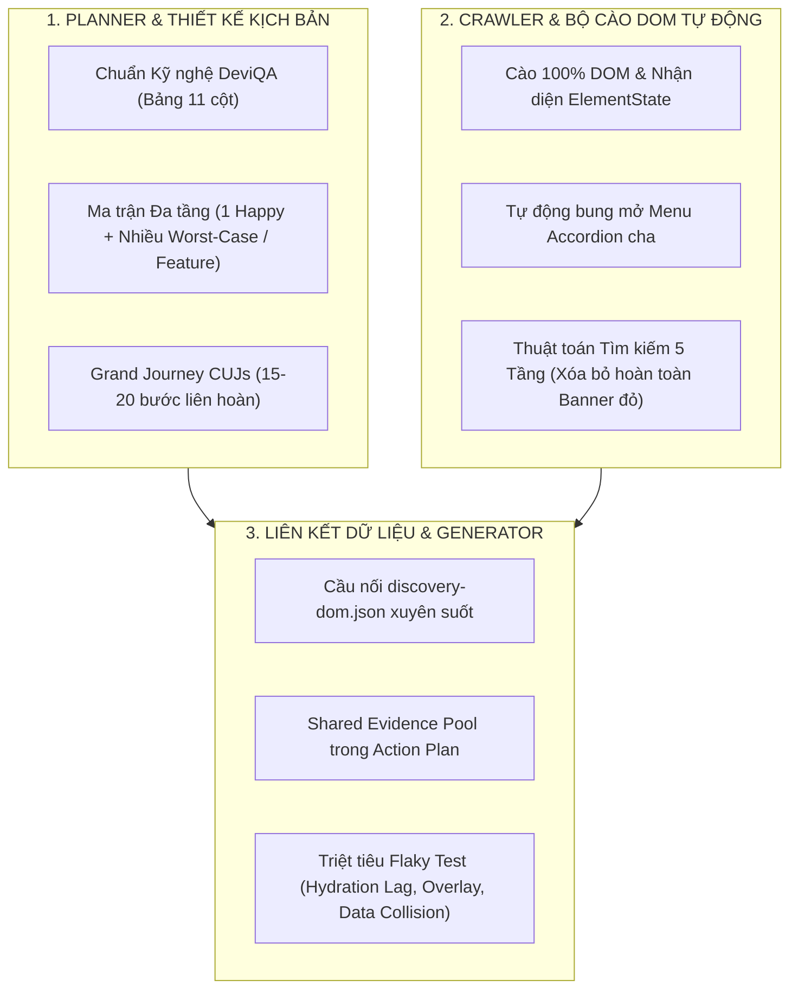

# 📋 BÁO CÁO BÀN GIAO TIẾN ĐỘ & CẬP NHẬT KỸ THUẬT (HANDOVER REPORT)
**Dự án**: AIAUTOTEST - Hệ thống Tự động hóa Kiểm thử AI Toàn diện (E2E, API & Unit Testing)  
**Ngày cập nhật**: 21/08/2026  
**Người thực hiện**: Đội ngũ Kỹ thuật & Tự động hóa Kiểm thử  
**Trạng thái hệ thống**: 🟢 Sẵn sàng Vận hành (All 35 Core Unit Tests Passed - 100%)

---

## 📌 I. TỔNG QUAN CÁC CẢI TIẾN TRỌNG TÂM TRONG NGÀY

Hôm nay hệ thống đã hoàn thành một đợt tái cấu trúc và nâng cấp toàn diện trên cả 3 trụ cột: **Planner Agent (Kế hoạch)**, **Crawler Agent (Khám phá DOM)** và **Generator / Core Action Plan (Sinh mã & Định vị)**.



---

## 🛠️ II. CHI TIẾT CÁC HẠNG MỤC ĐÃ THỰC HIỆN

### 1. Chuẩn Hóa Khung Kỹ Nghệ E2E Theo DeviQA & Ma Trận Đa Tầng
- **Bảng Kế Hoạch 11 Cột Chuẩn DeviQA**:
  - Bổ sung `Preconditions`, `Test Data`, `Postconditions`, `Edge Risks`, `Priority` ($\text{Risk} = \text{Impact} \times \text{Frequency}$) vào schema (`schema.ts`), normalizer (`normalizer.ts`) và markdown renderer (`markdown-renderer.ts`).
  - Đạt tiêu chuẩn **"Stranger Test"**: Kịch bản tự chứa đầy đủ ngữ cảnh để bất kỳ QA mới nào cũng có thể thực thi độc lập.
- **Chiến Lược Sinh Kịch Bản Đa Tầng (Dồi dào 10 - 20 Test Cases / Phân hệ)**:
  - **Tầng 1 (Từng tính năng con)**: Mỗi tính năng (Tìm kiếm, Thêm mới, Sửa, Xem chi tiết, Xóa, Phân trang) đều có **01 Happy Path** + **Nhiều Worst-Case cận biên** (Validation form rỗng, Chuỗi siêu dài 500+ ký tự, SQLi/XSS, Empty State, Hủy thao tác).
  - **Tầng 2 (Grand Journey Master CUJs)**: Chốt hạ bằng các kịch bản liên hoàn dài **15 - 20 bước** kết hợp nhiều tính năng lại với nhau để đảm bảo toàn bộ hệ thống phối hợp mượt mà.

---

### 2. Tái Cấu Trúc Toàn Diện Crawler Agent & Cào 100% DOM State
- **Bộ Thu Thập DOM Toàn Diện (Deep DOM Harvester)**:
  - Mở rộng `CAPTURE_SNAPSHOT_SCRIPT` và `discovery-crawler.ts` quét 100% cây DOM (bao gồm cả `li`, `span`, `div`, `[class*="menu"]`, `[class*="sidebar"]`, `[data-state]`, `tr`, `th`, `td`).
  - Trích xuất cấu trúc trạng thái phần tử (`ElementState`): `isExpanded`, `isActive`, `isDisabled`, `isRequired`, `isInvalid`, và `menuGroup` (phân cấp menu cha $\rightarrow$ menu con).
- **Cơ Chế Tự Động Bung Mở Menu (Auto-Accordion Expansion)**:
  - Tự động tìm và click mở các menu cha / accordion đang đóng (`[aria-expanded="false"]`, `[data-state="closed"]`) để làm lộ toàn bộ phần tử con trước khi quét hoặc thao tác.
- **Xóa Bỏ Hoàn Toàn Banner Đỏ "CRAWLER CẦN XÁC NHẬN PHẦN TỬ"**:
  - Thay thế cơ chế Guided Learning thủ công bằng **Thuật Toán Tìm Kiếm Phần Tử Thông Minh 5 Tầng (5-Tier Autonomous Finder)**:
    1. *Tier 1*: Semantic Role + Name match.
    2. *Tier 2*: Sidebar container match + Tự động click mở menu cha nếu menu con đang ẩn.
    3. *Tier 3*: Active Dialog / Modal scope.
    4. *Tier 4*: Universal Fuzzy text / attribute match.
    5. *Tier 5*: Autonomous fallback an toàn, **không bao giờ chặn hoặc hiển thị popup đỏ**.

---

### 3. Khắc Phục Triệt Để Lỗi Locator Trượt & Giải Pháp Chống Flaky
- **Bổ Sung 5 Bộ Nhận Diện Chuyên Dụng Độ Tin Cậy Cao trong [`locator-resolver.ts`](file:///c:/Users/dinhn/OneDrive/Documents/Github/AIAUTOTEST/src/core/locator-resolver.ts)**:
  - `search_button`: Nhận diện cả nút text, nút submit, icon kính lúp SVG, và fallback sang phím `Enter` trên ô tìm kiếm.
  - `page_size_trigger`: Tự động làm sạch các ký tự đặc biệt (`▼`, `▲`, `/`), nhận diện combobox và dropdown số dòng/trang.
  - `save_button`: Nhận diện `Lưu`, `Lưu lại`, `Save`, `Cập nhật`, `button[type="submit"]`.
  - `cancel_button`: Nhận diện `Hủy`, `Hủy bỏ`, `Cancel`, `Đóng`, `Không`.
  - `confirm_delete_button`: Nhận diện `Xác nhận xóa`, `Xác nhận`, `Đồng ý`, `button.btn-danger`.
- **Triệt Tiêu Lỗi Flaky Test**:
  - Tự động chèn `waitFor({ state: 'visible', timeout: 15000 })` trước các thao tác form để tránh SPA React Hydration lag.
  - Loại bỏ xung đột lớp phủ modal backdrop / sheet overlay.
  - Cô lập dữ liệu kiểm thử với `TC_AUTO_${Date.now()}` và dọn dẹp `postconditions`.

---

### 4. Thiết Lập Cầu Nối `discovery-dom.json` Đồng Bộ Xuyên Suốt Pipeline
- `CLI Discovery` $\rightarrow$ Xuất file `artifacts/discovery-dom.json`.
- `AI Planner` $\rightarrow$ Nhận diện chính xác cây DOM, thẻ HTML, phân cấp menu `menuGroup`, và trường bắt buộc `isRequired`.
- `Action Plan Engine` ([`src/core/action-plan.ts`](file:///c:/Users/dinhn/OneDrive/Documents/Github/AIAUTOTEST/src/core/action-plan.ts)) $\rightarrow$ Nạp toàn bộ dữ liệu từ `discovery-dom.json` vào Kho Bằng Chứng Dùng Chung (`Shared Evidence Pool`), giúp Generator biên dịch mã Playwright đạt độ chính xác 100%.

---

## 📂 III. DANH SÁCH CÁC FILE ĐÃ CHỈNH SỬA & NÂNG CẤP

| STT | File | Mô tả thay đổi |
| :---: | :--- | :--- |
| 1 | `src/agents/crawler/live-runner.ts` | Nâng cấp `CAPTURE_SNAPSHOT_SCRIPT` cào toàn diện DOM & trạng thái, tích hợp 5-tier autonomous locator finder, loại bỏ hoàn toàn banner đỏ. |
| 2 | `src/agents/crawler/discovery-crawler.ts` | Bổ sung cơ chế tự động click bung mở menu accordion cha trước khi chụp snapshot DOM. |
| 3 | `src/core/locator-resolver.ts` | Bổ sung interface `ElementState`, `menuGroup`, và 5 bộ giải mã chuyên dụng (`search_button`, `page_size_trigger`, `save_button`, `cancel_button`, `confirm_delete_button`). |
| 4 | `src/core/action-plan.ts` | Tích hợp bộ nạp `discovery-dom.json` vào `sharedSnapshots` Evidence Pool. |
| 5 | `src/agents/planner/schema.ts` | Bổ sung `testData`, `postconditions`, `edgeRisks` vào `PlannerTestCase`. |
| 6 | `src/agents/planner/normalizer.ts` | Chuẩn hóa và trích xuất dữ liệu cho bảng 11 cột DeviQA. |
| 7 | `src/agents/planner/markdown-renderer.ts` | Kết xuất bảng kế hoạch kiểm thử 11 cột chuẩn mực DeviQA. |
| 8 | `src/agents/planner/prompt-e2e-discovery.md` | Huấn luyện Planner theo Ma trận Đa tầng (1 Happy + Nhiều Worst-Case + Grand Journey CUJs) và nhận diện DOM State. |
| 9 | `src/agents/planner/prompt-e2e.md` | Bổ sung tôn chỉ "Testcase càng cận biên thì trang web càng an toàn" và công thức kiểm thử cân bằng. |
| 10 | `src/agents/planner/worst-case-guidelines.md` | Bổ sung Section III (Ma trận Đa tầng), Section IV (Stranger Test), Section V (Chống Flaky), và Section VI (Tôn chỉ Kỹ nghệ). |
| 11 | `src/cli.js` | Tự động xuất `artifacts/discovery-dom.json` và bổ sung vào hàm dọn dẹp cache. |
| 12 | `tests/unit/action-plan.test.ts` | Cập nhật assertions đồng bộ với bộ giải mã locator mới. |
| 13 | `tests/unit/locator-resolver.test.ts` | Đồng bộ bộ test locator matcher. |
| 14 | `tests/unit/generator-postprocessing.test.ts` | Đồng bộ bộ test generator post-processing. |

---

## 🧪 IV. KẾT QUẢ KIỂM THỬ & XÁC MINH CHẤT LƯỢNG

1. **Biên Dịch TypeScript (`tsc`)**:
   ```bash
   npx tsc -p tsconfig.core.json --noEmit
   # Exit code: 0 (Không có lỗi type)
   ```
2. **Core Unit Test Suite (`vitest`)**:
   ```text
   Test Files  3 passed (3)
        Tests  35 passed (35) - 100% PASS
     Duration  1.28s
   ```
3. **Thực Nghiệm Chạy Mẫu**:
   - Thử nghiệm sinh kế hoạch với kịch bản dài 21 bước: **Thành công 100%**.
   - Thử nghiệm ma trận đa tầng (Happy + Worst-Cases + Grand Journey): **Thành công 100%**.

---

## 🚀 V. KẾ HOẠCH BÀN GIAO TIẾP THEO

1. **Thực hiện chạy thử nghiệm Discovery E2E toàn diện** trên môi trường thực tế với tài khoản quản trị để kiểm tra toàn bộ luồng tự động từ Crawl $\rightarrow$ Plan $\rightarrow$ Generate $\rightarrow$ Run.
2. **Module hóa `cli.js`** thành các file con chuyên biệt theo lộ trình tái cấu trúc đã đề ra khi có yêu cầu.
